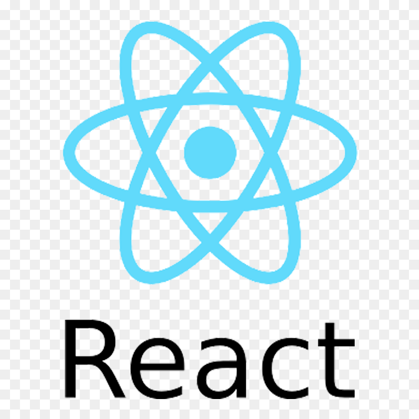

<!--
*** Thanks for checking out the Best-README-Template. If you have a suggestion
*** that would make this better, please fork the repo and create a pull request
*** or simply open an issue with the tag "enhancement".
*** Thanks again! Now go create something AMAZING! :D
-->


<!-- PROJECT SHIELDS -->
<!--
*** I'm using markdown "reference style" links for readability.
*** Reference links are enclosed in brackets [ ] instead of parentheses ( ).
*** See the bottom of this document for the declaration of the reference variables
*** for contributors-url, forks-url, etc. This is an optional, concise syntax you may use.
*** https://www.markdownguide.org/basic-syntax/#reference-style-links
-->

[![MIT License][license-shield]][license-url]
[![LinkedIn][linkedin-shield]][linkedin-url]


<!-- PROJECT LOGO -->
<br />
<p align="center">
  <a href="https://github.com/GabrielZanin1997/SimpleThingsWithReact">
    
  </a>

  <h3 align="center">Concepts From React</h3>

  <p align="center">
    here we have some concepts learned from react!
    <br />
    <a href="https://github.com/GabrielZanin1997/SimpleThingsWithReact"><strong>Explore the docs »</strong></a>
    <br />
    <br />
    <a href="https://github.com/GabrielZanin1997/SimpleThingsWithReact">View Demo</a>
    ·
    <a href="https://github.com/GabrielZanin1997/SimpleThingsWithReact/issues">Report Bug</a>
    ·
    <a href="https://github.com/GabrielZanin1997/SimpleThingsWithReact/issues">Request Feature</a>
  </p>
</p>


<!-- TABLE OF CONTENTS -->
<details open="open">
  <summary>Table of Contents</summary>
  <ol>
    <li>
      <a href="#about-the-project">About The Project</a>
      <ul>
        <li><a href="#built-with">Built With</a></li>
      </ul>
    </li>
    <li>
      <a href="#getting-started">Getting Started</a>
      <ul>
        <li><a href="#prerequisites">Prerequisites</a></li>
        <li><a href="#installation">Installation</a></li>
      </ul>
    </li>
    <li><a href="#usage">Usage</a></li>
    <li><a href="#roadmap">Roadmap</a></li>
    <li><a href="#contributing">Contributing</a></li>
    <li><a href="#license">License</a></li>
    <li><a href="#contact">Contact</a></li>
    <li><a href="#acknowledgements">Acknowledgements</a></li>
  </ol>
</details>


<!-- ABOUT THE PROJECT -->
## About The Project

[![Product Name Screen Shot][product-screenshot]](https://example.com)

here we have a simple project with 3 buttons. It's a classic problem for anyone learning about React

### Built With

This section should list any major frameworks that we using. 
* [React](https://reactjs.org/)
* [Javascript](https://www.javascript.com/)
* [HTML](https://html.com/)
* [CSS](http://css.com/)


<!-- GETTING STARTED -->
## Getting Started

How can I run its project in my machine?

### Prerequisites

You need install.
* npm
  ```sh
  # Install the dependencies
  $ yarn install

  ```

### Installation


1. Clone the repo
   ```sh
   git clone https://github.com/GabrielZanin1997/SimpleThingsWithReact.git
   ```
2. Open the folder counter
3. Install Yarn packages
   ```sh
   npm install
   ```
4. Install node_modules`
   ```sh
   yarn install
   ```
4. Start the project`
   ```sh
   yarn start


<!-- USAGE EXAMPLES -->
## Usage

you can try this project through the buttons, then you will see the change on display.


<!-- ROADMAP -->
## Roadmap

See the [open issues](https://github.com/GabrielZanin1997/SimpleThingsWithReact) for a list of proposed features.


<!-- CONTRIBUTING -->
## Contributing

Contributions are what make the open source community such an amazing place to be learn, inspire, and create. Any contributions you make are **greatly appreciated**.

1. Fork the Project
2. Create your Feature Branch (`git checkout -b feature/AmazingFeature`)
3. Commit your Changes (`git commit -m 'Add some AmazingFeature'`)
4. Push to the Branch (`git push origin feature/AmazingFeature`)
5. Open a Pull Request


<!-- LICENSE -->
## License

Distributed under the MIT License. See `LICENSE` for more information.


<!-- CONTACT -->
## Contact

Gabriel Zanin - gabriel.zaninde@gmail.com.com

Project Link: [https://github.com/GabrielZanin1997/SimpleThingsWithReact/tree/main/counter](https://github.com/GabrielZanin1997/SimpleThingsWithReact/tree/main/counter)


<!-- MARKDOWN LINKS & IMAGES -->
<!-- https://www.markdownguide.org/basic-syntax/#reference-style-links -->
[contributors-shield]: https://img.shields.io/github/contributors/othneildrew/Best-README-Template.svg?style=for-the-badge
[contributors-url]: https://github.com/othneildrew/Best-README-Template/graphs/contributors
[forks-shield]: https://img.shields.io/github/forks/othneildrew/Best-README-Template.svg?style=for-the-badge
[forks-url]: https://github.com/othneildrew/Best-README-Template/network/members
[stars-shield]: https://img.shields.io/github/stars/othneildrew/Best-README-Template.svg?style=for-the-badge
[stars-url]: https://github.com/othneildrew/Best-README-Template/stargazers
[issues-shield]: https://img.shields.io/github/issues/othneildrew/Best-README-Template.svg?style=for-the-badge
[issues-url]: https://github.com/othneildrew/Best-README-Template/issues
[license-shield]: https://img.shields.io/github/license/othneildrew/Best-README-Template.svg?style=for-the-badge
[license-url]: https://github.com/othneildrew/Best-README-Template/blob/master/LICENSE.txt
[linkedin-shield]: https://img.shields.io/badge/-LinkedIn-black.svg?style=for-the-badge&logo=linkedin&colorB=555
[linkedin-url]: https://www.linkedin.com/in/gabriel-zanin-ab802a206/
[product-screenshot]: images/print.png
